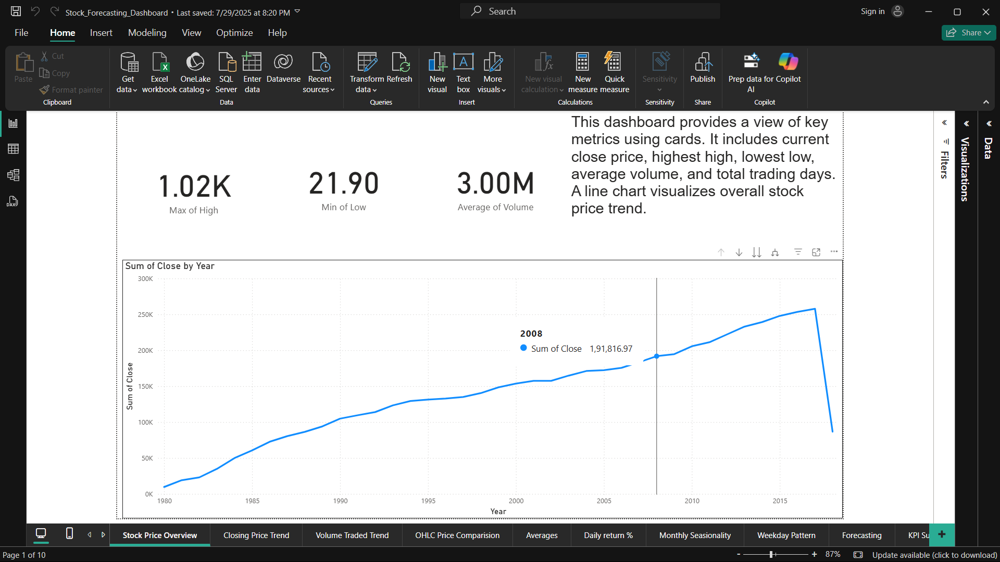

# Time Series Analysis and Forecasting for Stock Market

**Models included:** ARIMA, SARIMA, Prophet, LSTM  
**Default ticker:** AAPL

## Quick start
1. Create and activate a virtualenv:
   ```
   python -m venv venv
   source venv/bin/activate   # macOS / Linux
   venv\Scripts\activate    # Windows
   pip install -r requirements.txt
   ```
2. Download data (example):
   ```
   python -m src.data_loader --tickers AAPL --start 2015-01-01 --end 2024-12-31
   ```
3. Train models:
   ```
   python -m src.train --ticker AAPL --models arima prophet lstm --save_dir models/
   ```
4. Evaluate:
   ```
   python -m src.evaluate --ticker AAPL --models_dir models/ --out_dir reports/figures/
   ```

## Repo structure
See `notebooks/` for interactive demos and `src/` for runnable modules.

## Notes
- `data/raw/` and `models/` are gitignored by default.
- If you want to skip LSTM, install without TensorFlow in `requirements.txt`.

## 📊 Power BI Dashboard

The project also includes an interactive Power BI dashboard that visualizes key trends, patterns, and model predictions.

**File:** [`Stock_Forecasting_Dashboard.pbix`](dashboards/Stock_Forecasting_Dashboard.pbix)

You can open it in Power BI Desktop to explore:
- Stock price trends and moving averages  
- Model forecast vs actual price comparison  
- Prophet & LSTM forecast visualizations  
- Interactive date filters and performance KPIs


